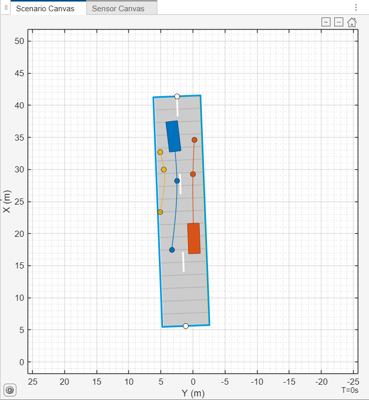
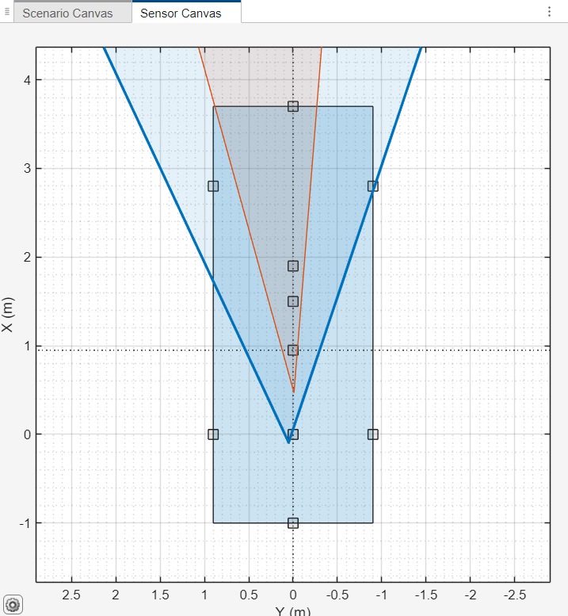
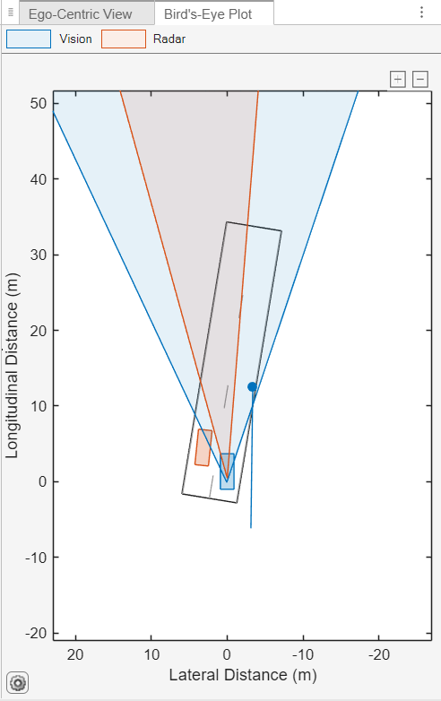
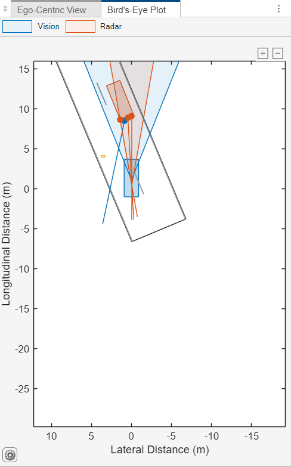
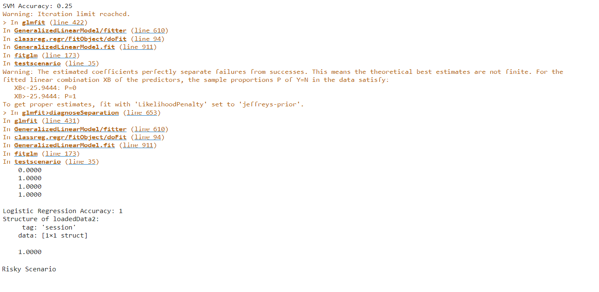

# Classifying Object Behavior to Enhance the Safety of Autonomous Vehicles
## Overview
With the rapid advancement of autonomous vehicle (AV) technologies, ensuring safety in complex and dynamic driving environments has become a top priority. This project presents a complete pipeline for classifying object behavior—such as vehicles, pedestrians, and cyclists—as either Safe or Risky, based on simulation and sensor data.

Using MATLAB's Automated Driving Toolbox and Machine Learning Toolbox, the project involves:

Simulation of real-world traffic scenarios,

Sensor integration on the ego vehicle,

Extraction and fusion of sensor data,

Machine learning model training (SVM and Logistic Regression),

Performance evaluation on unseen scenarios.

## Objectives
Simulate safe and risky driving conditions using MATLAB tools.

Acquire synthetic sensor data from mounted radar and camera modules.

Preprocess and label this data to train behavior classification models.

Test these models on new scenarios to assess classification performance.

Improve AV decision-making by accurately identifying potentially hazardous situations.

## Motivation
Autonomous vehicles must interpret the actions and intentions of surrounding objects to navigate safely. Whether a vehicle ahead is making a sudden stop or a pedestrian is about to cross the road—these subtle behaviors must be detected early to avoid accidents.

This project contributes to that goal by implementing a behavior prediction and classification system that enables AVs to respond more intelligently to their environment.

## Project Pipeline
1. Designing Simulation Scenarios
Using MATLAB’s Driving Scenario Designer, multiple traffic scenarios were built to simulate both safe (normal traffic flow) and risky (sudden braking, pedestrians crossing, etc.) situations.
Scenario Design:

2. Creating the Dataset
A total of 21 scenarios were generated:

11 Safe
10 Risky

Each scenario includes position, velocity, and detection data captured through simulated sensors. The dataset is structured to include:

Actor positions
Sensor detections
Ego vehicle state
Scenario metadata

3. Mounting Sensors on Ego Vehicle
A front-facing radar and camera were mounted on the ego vehicle.

Sensor configuration ensures maximum field of view and coverage.

Simulated data includes distance, velocity, and angle of surrounding objects.
Sensor Mounting:

4. Extracting and Labeling Sensor Data
All sensor data from individual scenarios was loaded and combined into a single file. Key features like:

Distance to object

Relative speed

Actor movement patterns

Units-per-pixel in bird's eye view
were extracted and labeled (0 = Safe, 1 = Risky).
Safety Scenario:

Risky Scenario:

5. Training Machine Learning Models
The project utilizes two classification algorithms:

Support Vector Machine (SVM)

Logistic Regression

Workflow:

Split data into training (80%) and testing (20%) sets using dividerand.

Train models using MATLAB’s fitcsvm and fitglm.

Evaluate performance based on prediction accuracy.

6. Testing on New Scenario
A new unseen risky scenario was created to validate the model. The classifier successfully predicted the behavior, confirming the model's generalization capability.
Final Output

